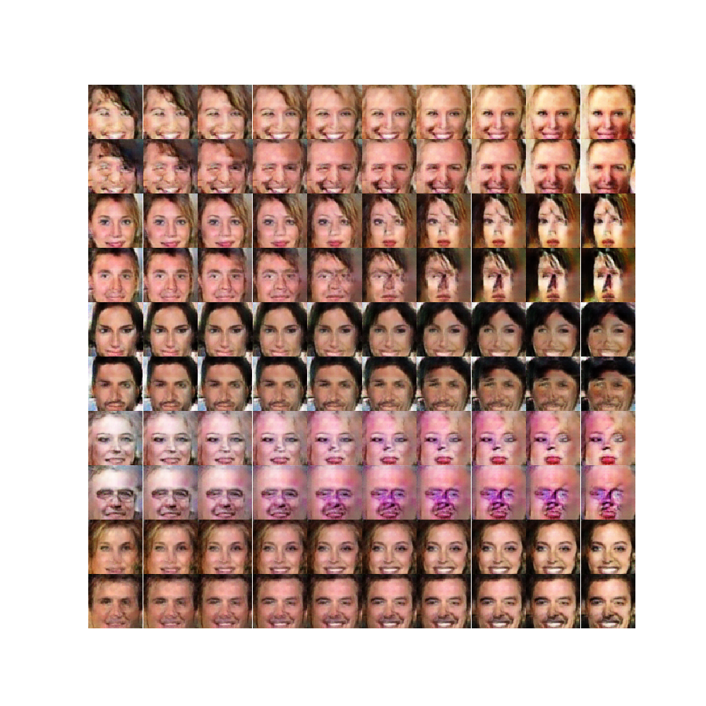

# Conditional DCGAN
PyTorch implementation of Conditional Deep Convolutional Generative Adversarial Networks (cDCGAN)

## Generating MNIST dataset
* MNIST image is resized to 32x32 size image

### Network architecture
* Generator
    * hidden layers: Three 4x4 strided convolutional layers (512, 256, and 128 kernels, respectively) with ReLU
    * output layer: 4x4 strided convolutional layer (1024 nodes = 32x32 size image) with Tanh
    * Batch normalization is used except for output layer

* Discriminator
    * hidden layers: Three 4x4 convolutional layers (128, 256, and 512 kernels, respectively) with Leaky ReLU
    * output layer: 4x4 convolutional layer (1 node) with Sigmoid
    * Batch normalization is used except for 1st hidden layer & output layer

### Results
* Adam optimizer is used. Learning rate for generator = 0.0002 and 0.0001 for discriminator, batch size = 128, # of epochs = 20:
<table align='center'>
<tr align='center'>
<td> GAN losses</td>
<td> Generated images</td>
</tr>
<tr>
<td>
<td>
</tr>
</table>

## Generating CelebA dataset
* Center region of CelebA image is cropped (108x108 for male/female, 150x150 for black/brown hair) and resized to 64x64 size image

### Network architecture
* Generator
    * hidden layers: Four 4x4 strided convolutional layers (1024, 512, 256, and 128 kernels, respectively) with ReLU
    * output layer: 4x4 strided convolutional layer (4096 nodes = 64x64 size image) with Tanh
    * Batch normalization is used except for output layer

* Discriminator
    * hidden layers: Four 4x4 convolutional layers (128, 256, 512 and 1024 kernels, respectively) with Leaky ReLU
    * output layer: 4x4 convolutional layer (1 node) with Sigmoid
    * Batch normalization is used except for 1st hidden layer & output layer
    
### Results
* Adam optimizer is used. Learning rate = 0.0002 both for generator and discriminator, batch size = 128, # of epochs = 20:
* Loss values are plotted using [Tensorboard in PyTorch](https://github.com/yunjey/pytorch-tutorial/tree/master/tutorials/04-utils/tensorboard).
* Images are generated with fixed noise and varying gender label (1st, 3rd rows: female / 2nd, 4th rows: male)
<table align='center'>
<tr align='center'>
<td> GAN losses</td>
<td> Generated images</td>
</tr>
<tr>
<td>
<td>
</tr>
</table>

* Images are generated with fixed noise and varying hair color label (1st, 3rd rows: brown hair / 2nd, 4th rows: black hair)
* Only 87,772 images (black hair: 47,336 / brown hair: 40,436) are sampled from original CelebA data for training.
<table align='center'>
<tr align='center'>
<td> GAN losses</td>
<td> Generated images</td>
</tr>
<tr>
<td>
<td>
</tr>
</table>

* Generated images varying latent variable
    * Odd rows: female / Even rows: male
    
    * Odd rows: brown hair / Even rows: black hair
    

### References
1. https://wiseodd.github.io/techblog/2016/12/24/conditional-gan-tensorflow/
2. https://github.com/znxlwm/pytorch-MNIST-CelebA-cGAN-cDCGAN
3. https://github.com/moono/moo-dl-practice/tree/master/Work-place/CDCGAN-MNIST
4. https://github.com/moono/moo-dl-practice/tree/master/Work-place/CDCGAN-celebA